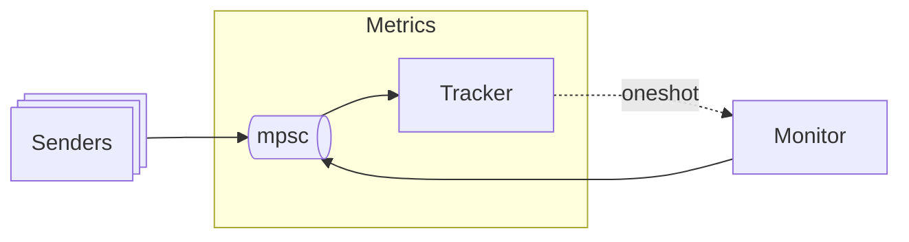

# sms-simulation — A Simulation of an SMS Alert System

Challenge: design and implement a scalable SMS alert simulation system. The
system consists of a message producer, message senders, and a progress monitor.

## Usage

```plain
$ cargo run
```

will run the program with a set of reasonable defaults. Every setting can be
overridden via command line switches:

```plain
$ cargo run -- --help
A simulation of an SMS alert system.

Usage: sms-simulation [OPTIONS]

Options:
  -s, --num-senders <NUM>
          Number of concurrent senders [default: 32]
  -m, --num-messages <NUM>
          Number of messages to produce [default: 1000]
  -t, --send-duration <MS>
          Mean send duration, in milliseconds [default: 250]
  -f, --failure-rate <PERCENT>
          How often a failure occurs [default: 0.05]
  -u, --monitor-update <SECONDS>
          Rate to update the progress monitor at, in seconds [default: 2]
      --message-queue-depth <NUM>
          Producer/sender backpressure [default: 64]
  -h, --help
          Print help
  -V, --version
          Print version
```

Additionally, unit tests can be run using `cargo test`, and documentation can be
generated with `cargo doc`.

## Discussion

There are two core problems that we need to solve:
1. Single producer, multiple consumer SMS creation and delivery
2. Multiple producer, single consumer data collection and display

A typical solution to both problems uses shared data structures with read
and write access guarded by mutexes. One could create N+2 threads, for the
producer, monitor, and every sender. The producer could store messages in a
`VecDeque<String>` guarded by an `Arc<Mutex>` that the senders would read from.
Similarly, a shared `struct` guarded by an `Arc<Mutex>` could be used by the
senders and the progress monitor to collect and display data.

While this approach would work, it is not very scalable. The mutexes would be
highly contended, so we would want to implement a strong writer policy for the
sender and a strong reader policy for the monitor to avoid starvation. Threads
are managed by the kernel scheduler, so we only have a finite amount of control
over their behavior.

Instead, we can build a more efficient and ergonomic solution using the Tokio
framework. Tokio provides an asynchronous runtime and misuse-resistant
synchronization primitives so that we can focus on the problem at hand. In
particular, message passing via bounded channels provides many of the things we
need in one convenient package:
- Shared data structures
- Synchronization with fair polling
- Backpressure

### SMS Production and Sending

We want a single-producer multi-consumer channel where only one consumer sees
each message. The [`async-channel`](https://github.com/smol-rs/async-channel/)
crate uses a lock-free queue to implement this exact behavior.

We create a bounded instance of an `async_channel` and pass the `Sender` to the
producer task. We pass a `clone()` of the `Receiver` to each sender task.


The producer will `send()` SMS messages into the channel, waiting until there is
room if it is full. Once the producer has sent all of its messages it will
terminate. SMS strings are constructed by picking a random length from a range
of \[1, 100], and then randomly sampling that many characters from the
`Alphanumeric` distribution.

Each sender calls `recv()` in a loop, which removes an SMS from the channel
every iteration, or waits if the channel is empty.
Senders will run until the channel is closed; this occurs when the both the
`Sender` is dropped and the channel is empty.

### Metrics Collection and Display

The metrics tracker is an actor that manages access to the metrics data using
`mpsc` and `oneshot` channels in a request/response synchronization pattern.
Spawing the metrics task returns a `MetricsHandle` that contains the `mpsc`
channel's `Sender`. A `clone()` of this handle is passed to each sender task,
which uses it to record send/fail data and delivery duration for each message.



The monitor task wakes up at a fixed interval to request the latest metrics from
the tracker. If its `stop()` method is called, the monitor will fetch and
display metrics one last time before terminating. This lets us use a low polling
rate and still see all of the data collected by the tracker before the process
exits.
